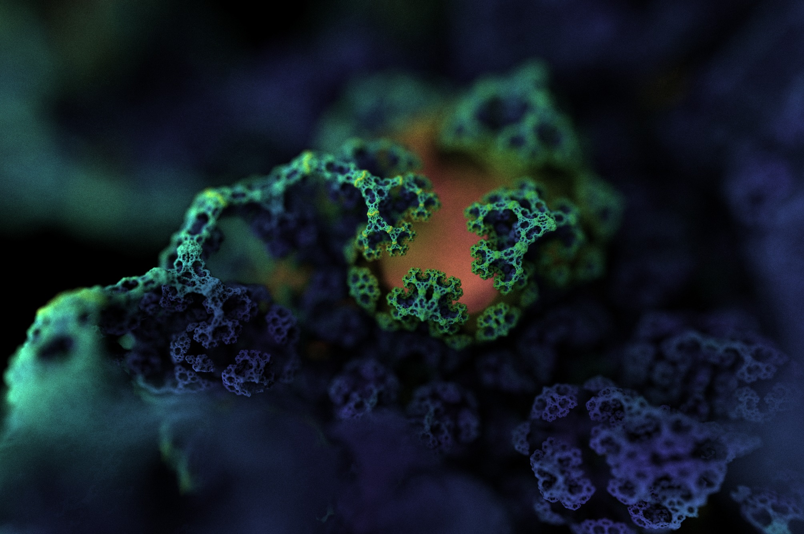

FractalView
===========

### 3D fractal renderer in GLSL. ###




Motivation
----------

Fractals, with their infinite detail and unpredictability, are really amazing to explore.

Though there exist many fractal renderers, like Mandelbulb3D or Fragmentarium,
which do their job very well and have many interesting features,
I started this project (or its early, uglier versions)
long before I tried using other software.
FractalView's main goals, besides learning new things, are:
GPU rendering, ease of use, and simplicity of code.


Features
--------

* Ray tracing with distance estimation (a.k.a. ray marching or sphere tracing).
* Progressive rendering for instantaneous preview and cost-free anti-aliasing and depth of field.
* Formulas for well-known fractals, such as Mandelbulb and Sierpiński tetrahedron.
* Several lighting methods, including path tracing with global illumination.
* Coloring using orbit trap method.
* Parameter values adjustable with sliders.


To-Do
-----

* Better, deterministic lighting (shadows and ambient occlusion) without path tracing
  (which currently doesn't work well for fractal interiors).
* Additional graphics effects: reflections, bloom, fog, texturing, etc.
* Support for custom scripts, especially for rendering standard geometry.
* Double precision calculations (probably not possible without a huge performance drop;
  shame on you, video card manufacturers!).


Usage
-----

FractalView is written in Electron (Node.js), so NPM (v6) is required.
All packages (like Three.js) will be installed automatically.

```
npm install
npm start
```

Try built-in fractals and play with their parameters or run some examples (`Ctrl`+`O`).
Move camera with your mouse, use mouse wheel to control its speed (and focal distance).

Note that a fast, dedicated GPU is highly recommended, especially for path tracing.
